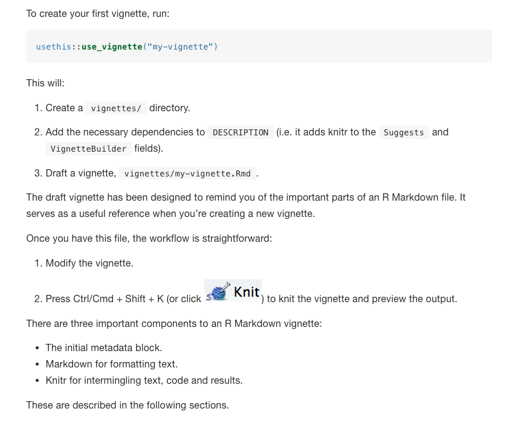

  
```{r setup, include=FALSE}

knitr::opts_chunk$set(echo = FALSE, 
                      comment = "", 
                      message = FALSE, 
                      warning = FALSE, 
                      echo = TRUE, 
                      eval = FALSE,
                      fig.height = 5,
                      fig.width = 8,
                      tidy = FALSE)
options(scipen=1, digits=2, width = 100)
```

# Introduction 
In this document, I summarize a simplified workflow for the R package development. 

## Outline of the workflow
The outline is the following:  

1. Create the framework of a package  
  
    1. Add functions, data 
    1. Add documents for your functions, data, and package  
    1. Update the package    
1. Release or upload your package  
1. Add the package into the **`prime.master`** package  


## R package development resource
There are many useful articles and books for R package development. The followings are some I'm using:

- [Writing an R package from scratch](https://hilaryparker.com/2014/04/29/writing-an-r-package-from-scratch/). In this article, the author gives a small and quick guidance for how to create a package. If you don't build any package before, you can just follow this article and you will create you own package within 10 minutes. 

- [R packages by Hadley Wickham](https://r-pkgs.org/index.html). In this book the author breaks the R packages into several parts and gives detailed introduction and descriptions. This document is based on the structure of this book. 

- [Object documentation](https://r-pkgs.org/man.html#man-functions). Besides the code, documentation is also very important. This website also introduces how to write document for a function.

# Create a package in R 

## R packages for development

- `devtools` and `usethis` for package development
- `roxygen2` for package document

```{r, eval=FALSE, echo=TRUE}
install.packages("usethis")
library(usethis)
install.packages("devtools")
library("devtools")
devtools::install_github("klutometis/roxygen")
library(roxygen2)
```

## Create an R package

Note that if you have installed `devtools` package. You can just run the following code
```{r}
create_package("~/Desktop/prime.test")
```
After running those code, R will create a folder with your package name, which is the `prime.test` in this case. This produces the smallest possible working package, with three components:

1. An `R/` directory, which you’ll learn about in [R code](https://r-pkgs.org/r.html#r).
1. A basic `DESCRIPTION` file, which you’ll learn about in (package metadata)[https://r-pkgs.org/description.html#description].
1. A basic `NAMESPACE` file, which you’ll learn about in the [namespace](https://r-pkgs.org/namespace.html#namespace). Note you **don't need to manually modify** this file.

## R package structure


# Add functions to your package 
After you create a package, you can copy all of your functions into the `R` folder. 

Note that you can use the [class system](https://www.datamentor.io/r-programming/object-class-introduction/) in R, such as `S3` or `S4` for your package, so that your package will be efficient and elegant in terms of the code structure. However, I'm not an expert on this topic, so I may not talk too much of it in this document. Further details of the class system of R can be found in [here](https://rstudio-education.github.io/hopr/s3.html#the-s3-system). 

## Test the functions

The workflow of testing your functions is the following:

1. Write a function
1. Load it with `devtools::load_all()`
1. Experiment with it in the console to see if it works
1. Rinse and repeat


## Document the functions
Documentation is important for a package. The good news is that `roxygen2` package can help us to add help documents in a simple way. Following is the workflow


Following is an R script of a function with help document:

Create a file named `prime.add.R` with path `~/Desktop/prime.test/R/prime.add.R`. Then copy the following R code into `prime.add.R`.

```{r}
#' Add together two numbers.
#'
#' @param x A number.
#' @param y A number.
#' @return The sum of \code{x} and \code{y}.
#' @examples
#' add(1, 1)
#' add(10, 1)

#' @import MASS
#' @export

prime.add <- function(x, y) {
  x + y
}

```

Note that  

- `#'` is the syntax of `roxygen2` to add items in the help document of a function.  
- `@param` means the details of a function input and `@return` is the details for the output
- `@import` is for any libraries the function are depending on, so that you *don't need to load* them inside your function
- `@export` means this function can be seen after you install the package. For some situation, you may want a function as invisible, then you just do not add the `@export` in the script.

Further details of the documentation syntax can be found in [here](https://r-pkgs.org/man.html#man-functions).

After editing the script, you can run the following code to update the help documents of your package.

```{r}
document("~/Desktop/prime.test/")
install("~/Desktop/prime.test/")
library(prime.test)
```

After loading the `prime.test` package. The help document of the `prime.add` can be in the help section, which looks like the following


# Add a data set to your package

There are several ways to add a data into your package. Here, I introduce the most straightforward approach. Further details of adding a data set can be found in [here](http://r-pkgs.had.co.nz/data.html)

## Use the `usethis::use_data` 

Let's create two random vectors and save them into the `prime.test` package. 
Note that in order to run the following code, you need to use the Rstudio to open your package `project`. Copy the following code to your R console and run. If everything is OK, you should get a notation saying your data set has been added into your package.

```{r}
set.seed(123)
data.x <- rnorm(100)
data.y <- rnorm(100)
use_data(data.x)
use_data(data.y)
```

## Add document for your data set 

Documentation of a data is similar with a function, the difference is that you need to write your document into a `.R` file in the `data/` folder. 

Create a file named `data.R` with path `~/Desktop/prime.test/R/data.R`. Then copy the following R code into `data.R`.

```{r}
#' A random vector generated from normal distribution
#'
#' Some description of the data
#'
#' @format A numeric vector of length 100
#' \describe{
#'   \item{V1}{...}
#'   \item{V2}{...}
#'   ...
#' }
"data.x"

#' A random vector generated from normal distribution
#'
#' Some description of the data
#'
#' @format A numeric vector of length 100
#' \describe{
#'   \item{V1}{...}
#'   \item{V2}{...}
#'   ...
#' }
"data.y"
```

Then run the following code into your console. 

```{r}
document("~/Desktop/prime.test/")
install("~/Desktop/prime.test/")
```

After reload the `prime.test`, you can access your data set just by their names, `data.x` and `data.y`. Besides, the help documents of the data set looks like the following


An example of using the data and the add function

```{r, eval=TRUE, collapse=T}
library(prime.test)
head(data.x)
head(data.y)
head(prime.add(data.x, data.y))
```

# Edit the `DESCRIPTION` file 

The `DESCRIPTION` file stores important information about your package. A simplified description file looks like the following. 

```
Package: prime.test
Title: What the Package Does (One Line, Title Case)
Version: 0.1
Authors@R: 
    person(given = "First",
           family = "Last",
           role = c("aut", "cre"),
           email = "first.last@example.com",
           comment = c(ORCID = "YOUR-ORCID-ID"))
Description: What the package does (one paragraph).
License: `use_mit_license()`, `use_gpl3_license()` or friends to
    pick a license
Encoding: UTF-8
LazyData: true
Roxygen: list(markdown = TRUE)
RoxygenNote: 7.1.0
Depends: 
    R (>= 3.1.0)
Import: 
    ggplot2,
    MASS
```

Not that the `import` sections are for the required packages, so you don't need to specify them during your function definitions. 
A further detailed introduction can be found in [here](https://r-pkgs.org/description.html#description).

## Add the long document for your package: 

There is another type of help document named vignettes. An example of it can be found [here](http://htmlpreview.github.io/?https://github.com/wal615/prime.total.effect/blob/master/doc/Summary.html).
The workflow is following:


The further detailed introduction can be found [here](https://r-pkgs.org/vignettes.html)
# Add your package to the **`prime.master`** package

After you finish your package, you may consider add it to a master package so that your method and data will be available to other groups when they install the master package. In order to achieve that, one possible solution is to 

1. Upload your package to Github   
2. Add your Github link to the master package  

## Upload your package to Github

Git is a version control tool. Github is a website on which you can share your R package and other code with others.
Good news is Rstudio is able to work with Git and Github well. However, you may need to be familar with the workflow of the Github. 

There is [detialed introduction](https://r-pkgs.org/git.html) about how to use Rstudio and Github to maintain your package.

## Modify the `DESCRIPTION` file in the `prime.master` package

After you upload your packge on the Github website, it is very straightforward to add it into the `prime.master` pacakge. You need to edit the `DESCRIPTION` file of the `prime.master` pacakge. In the following case, I add the `prime.test` into the `prime.master` via the `Remote` section. 

```
Package: prime.master
Title: What the Package Does (one line, title case)
Version: 0.0.0.9000
Authors@R: person("First", "Last", email = "first.last@example.com", role = c("aut", "cre"))
Description: What the package does (one paragraph).
Depends: R (>= 3.6),
         prime.total.effect,
         prime.test
License: What license is it under?
Encoding: UTF-8
LazyData: true
RoxygenNote: 7.1.0.9000
Remotes: github::prime-project-uic/prime.test, github::prime-project-uic/prime.total.effect
```


