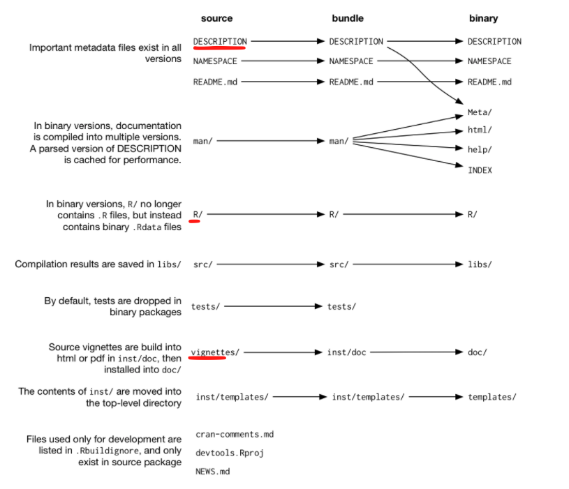
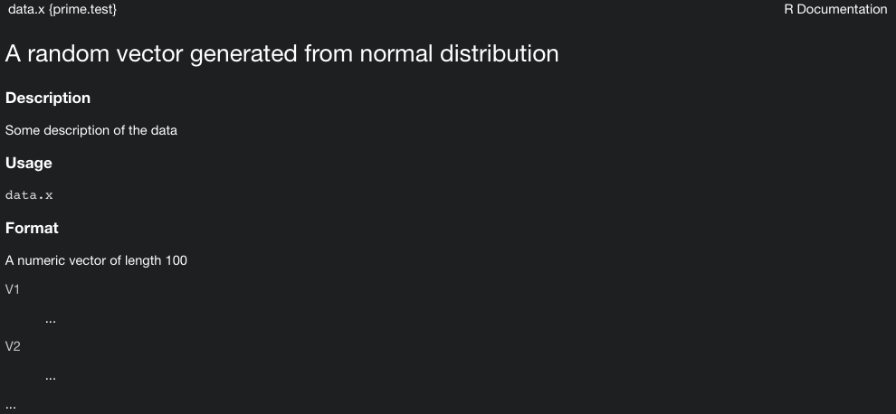

Prime package development document
================

  - [Introduction](#introduction)
      - [Outline of the workflow](#outline-of-the-workflow)
      - [R package development
        resource](#r-package-development-resource)
  - [Create a package in R](#create-a-package-in-r)
      - [R packages for development](#r-packages-for-development)
      - [Create an R package](#create-an-r-package)
      - [R package structure](#r-package-structure)
  - [Add functions to your package](#add-functions-to-your-package)
      - [Test the functions](#test-the-functions)
      - [Document the functions](#document-the-functions)
  - [Add a data set to your package](#add-a-data-set-to-your-package)
      - [Use the `usethis::use_data`](#use-the-usethisuse_data)
      - [Add document for your data
        set](#add-document-for-your-data-set)
  - [Edit the `DESCRIPTION` file](#edit-the-description-file)
      - [Add the long document for your
        package:](#add-the-long-document-for-your-package)
  - [Add your package to the **`prime.master`**
    package](#add-your-package-to-the-prime.master-package)
      - [Upload your package to Github](#upload-your-package-to-github)
      - [Modify the `DESCRIPTION` file in the `prime.master`
        package](#modify-the-description-file-in-the-prime.master-package)
  - [Release your package](#release-your-package)

# Introduction

In this document, I summarize a simplified workflow for the R package
development.

## Outline of the workflow

The outline is the following:

1.  Create the framework of a package
    
    1.  Add functions, data
    2.  Add documents for your functions, data, and package  
    3.  Update the package  

2.  Release or upload your package  

3.  Add the package into the **`prime.master`** package

## R package development resource

There are many useful articles and books for R package development. The
followings are some I’m using:

  - [Writing an R package from
    scratch](https://hilaryparker.com/2014/04/29/writing-an-r-package-from-scratch/).
    In this article, the author gives a small and quick guidance for how
    to create a package. If you don’t build any package before, you can
    just follow this article and you will create you own package within
    10 minutes.

  - [R packages by Hadley Wickham](https://r-pkgs.org/index.html). In
    this book the author breaks the R packages into several parts and
    gives detailed introduction and descriptions. This document is based
    on the structure of this book.

  - [Object documentation](https://r-pkgs.org/man.html#man-functions).
    Besides the code, documentation is also very important. This website
    also introduces how to write document for a function.

# Create a package in R

## R packages for development

  - `devtools` and `usethis` for package development
  - `roxygen2` for package document

<!-- end list -->

``` r
install.packages("usethis")
library(usethis)
install.packages("devtools")
library("devtools")
devtools::install_github("klutometis/roxygen")
library(roxygen2)
```

## Create an R package

Note that if you have installed `devtools` package. You can just run the
following code

``` r
create_package("~/Desktop/prime.test")
```

After running those code, R will create a folder with your package name,
which is the `prime.test` in this case. This produces the smallest
possible working package, with three components:

1.  An `R/` directory, which you’ll learn about in [R
    code](https://r-pkgs.org/r.html#r).
2.  A basic `DESCRIPTION` file, which you’ll learn about in (package
    metadata)\[<https://r-pkgs.org/description.html#description>\].
3.  A basic `NAMESPACE` file, which you’ll learn about in the
    [namespace](https://r-pkgs.org/namespace.html#namespace). Note you
    **don’t need to manually modify** this file.

## R package structure



# Add functions to your package

After you create a package, you can copy all of your functions into the
`R` folder.

Note that you can use the [class
system](https://www.datamentor.io/r-programming/object-class-introduction/)
in R, such as `S3` or `S4` for your package, so that your package will
be efficient and elegant in terms of the code structure. However, I’m
not an expert on this topic, so I may not talk too much of it in this
document. Further details of the class system of R can be found in
[here](https://rstudio-education.github.io/hopr/s3.html#the-s3-system).

## Test the functions

The workflow of testing your functions is the following:

1.  Write a function
2.  Load it with `devtools::load_all()`
3.  Experiment with it in the console to see if it works
4.  Rinse and repeat

## Document the functions

Documentation is important for a package. The good news is that
`roxygen2` package can help us to add help documents in a simple way.
Following is the workflow


Following is an R script of a function with help document:

Create a file named `prime.add.R` with path
`~/Desktop/prime.test/R/prime.add.R`. Then copy the following R code
into `prime.add.R`.

``` r
#' Add together two numbers.
#'
#' @param x A number.
#' @param y A number.
#' @return The sum of \code{x} and \code{y}.
#' @examples
#' add(1, 1)
#' add(10, 1)

#' @import MASS
#' @export

prime.add <- function(x, y) {
  x + y
}
```

Note that

  - `#'` is the syntax of `roxygen2` to add items in the help document
    of a function.  
  - `@param` means the details of a function input and `@return` is the
    details for the output
  - `@import` is for any libraries the function are depending on, so
    that you *don’t need to load* them inside your function
  - `@export` means this function can be seen after you install the
    package. For some situation, you may want a function as invisible,
    then you just do not add the `@export` in the script.

Further details of the documentation syntax can be found in
[here](https://r-pkgs.org/man.html#man-functions).

After editing the script, you can run the following code to update the
help documents of your package.

``` r
document("~/Desktop/prime.test/")
install("~/Desktop/prime.test/")
library(prime.test)
```

After loading the `prime.test` package. The help document of the
`prime.add` can be in the help section, which looks like the following


# Add a data set to your package

There are several ways to add a data into your package. Here, I
introduce the most straightforward approach. Further details of adding a
data set can be found in [here](http://r-pkgs.had.co.nz/data.html)

## Use the `usethis::use_data`

Let’s create two random vectors and save them into the `prime.test`
package. Note that in order to run the following code, you need to use
the Rstudio to open your package `project`. Copy the following code to
your R console and run. If everything is OK, you should get a notation
saying your data set has been added into your package.

``` r
set.seed(123)
data.x <- rnorm(100)
data.y <- rnorm(100)
use_data(data.x)
use_data(data.y)
```

## Add document for your data set

Documentation of a data is similar with a function, the difference is
that you need to write your document into a `.R` file in the `data/`
folder.

Create a file named `data.R` with path `~/Desktop/prime.test/R/data.R`.
Then copy the following R code into `data.R`.

``` r
#' A random vector generated from normal distribution
#'
#' Some description of the data
#'
#' @format A numeric vector of length 100
#' \describe{
#'   \item{V1}{...}
#'   \item{V2}{...}
#'   ...
#' }
"data.x"

#' A random vector generated from normal distribution
#'
#' Some description of the data
#'
#' @format A numeric vector of length 100
#' \describe{
#'   \item{V1}{...}
#'   \item{V2}{...}
#'   ...
#' }
"data.y"
```

Then run the following code into your console.

``` r
document("~/Desktop/prime.test/")
install("~/Desktop/prime.test/")
```

After reload the `prime.test`, you can access your data set just by
their names, `data.x` and `data.y`. Besides, the help documents of the
data set looks like the following



An example of using the data and the add function

``` r
library(prime.test)
head(data.x)
[1] -0.560 -0.230  1.559  0.071  0.129  1.715
head(data.y)
[1] -0.710  0.257 -0.247 -0.348 -0.952 -0.045
head(prime.add(data.x, data.y))
[1] -1.271  0.027  1.312 -0.277 -0.822  1.670
```

# Edit the `DESCRIPTION` file

The `DESCRIPTION` file stores important information about your package.
A simplified description file looks like the following.

    Package: prime.test
    Title: What the Package Does (One Line, Title Case)
    Version: 0.1
    Authors@R: 
        person(given = "First",
               family = "Last",
               role = c("aut", "cre"),
               email = "first.last@example.com",
               comment = c(ORCID = "YOUR-ORCID-ID"))
    Description: What the package does (one paragraph).
    License: `use_mit_license()`, `use_gpl3_license()` or friends to
        pick a license
    Encoding: UTF-8
    LazyData: true
    Roxygen: list(markdown = TRUE)
    RoxygenNote: 7.1.0
    Depends: 
        R (>= 3.1.0)
    Import: 
        ggplot2,
        MASS

Not that the `import` sections are for the required packages, so you
don’t need to specify them during your function definitions. A further
detailed introduction can be found in
[here](https://r-pkgs.org/description.html#description).

## Add the long document for your package:

There is another type of help document named vignettes. An example of it
can be found
[here](http://htmlpreview.github.io/?https://github.com/wal615/prime.total.effect/blob/master/doc/Summary.html).
The workflow is following: 

The further detailed introduction can be found
[here](https://r-pkgs.org/vignettes.html)

# Add your package to the **`prime.master`** package

After you finish your package, you may consider add it to a master
package so that your method and data will be available to other groups
when they install the master package. In order to achieve that, one
possible solution is to

1.  Upload your package to Github  
2.  Add your Github link to the master package

## Upload your package to Github

Git is a version control tool. Github is a website on which you can
share your R package and other code with others. Evan Poworoznek has
created a Github folder for [PRIME](https://github.com/niehs-prime). You
could cantact him (Github username:@brjoubert) to add your github
account to the project so that you could add your own project inside
folder.

Good news is Rstudio is able to work with Git and Github well. However,
you may need to be familiar with the workflow of the Github.

There is [detialed introduction](https://r-pkgs.org/git.html) about how
to use Rstudio and Github to maintain your package.

## Modify the `DESCRIPTION` file in the `prime.master` package

After you upload your package on the Github website, it is very
straightforward to add it into the `prime.master` package. You need to
edit the `DESCRIPTION` file of the `prime.master` package. In the
following case, I add the `prime.test` into the `prime.master` via the
`Remote` section.

    Package: prime.master
    Title: What the Package Does (one line, title case)
    Version: 0.0.0.9000
    Authors@R: person("First", "Last", email = "first.last@example.com", role = c("aut", "cre"))
    Description: What the package does (one paragraph).
    Depends: R (>= 3.6),
             prime.total.effect,
             prime.test
    License: What license is it under?
    Encoding: UTF-8
    LazyData: true
    RoxygenNote: 7.1.0.9000
    Remotes: github::prime-project-uic/prime.test, github::prime-project-uic/prime.total.effect

# Release your package

The outline of releasing a package is the following:

1.  Pick a version number
      - Define a sequence of number in the `Version` section of the
        `DESCRIPTION` file.
      - The format is `major.minor.patch`, e.g. 1.8.2
2.  Run and document `R CMD check`
      - Operation system: MAC, Windows and Linux. (working at least
        under two environment)
      - errors, warnings and notes
      - The packages depend on your package can still work after update
3.  Check that you’re aligned with CRAN policies
      - Email address  
      - Clearly identified the copyright holders in `DESCRIPTION`
      - Working across multiple platforms
      - No administer permission
4.  Update README.md and NEWS.md
5.  Submit the package to CRAN
      - `devtools::release()`
6.  Prepare for the next version by updating version numbers
7.  Publicise the new version

The further detail introduction of releasing a package could be found
[here](https://r-pkgs.org/release.html)
